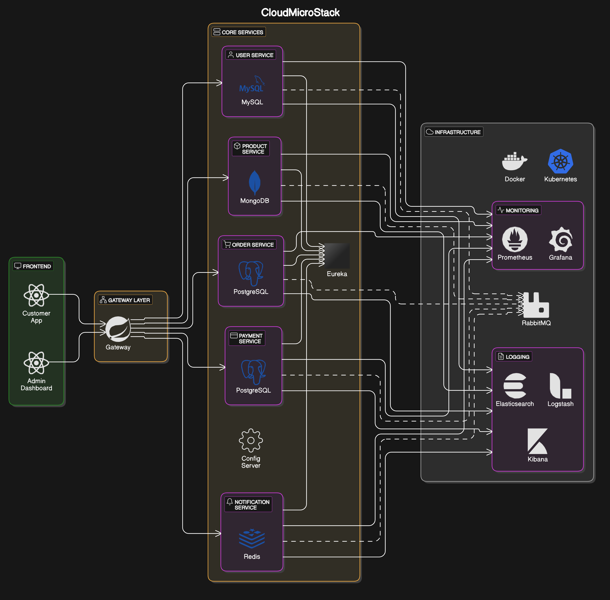

# CloudMicroStack

## Table of Contents

1. [Project Overview](#project-overview)
2. [Architecture Components](#architecture-components)
   - [Frontend Applications](#frontend-applications)
   - [Core Services](#core-services)
     - [API Gateway](#api-gateway-port-8080)
     - [Service Registry](#service-registry-port-8761)
     - [Config Server](#config-server-port-8888)
     - [User Service](#user-service-port-8081)
     - [Product Service](#product-service-port-8082)
     - [Order Service](#order-service-port-8083)
     - [Payment Service](#payment-service-port-8084)
     - [Notification Service](#notification-service-port-8085)
3. [Technology Stack](#technology-stack)
   - [Backend](#backend)
   - [Frontend](#frontend)
   - [Databases](#databases)
   - [Infrastructure](#infrastructure)
   - [Monitoring & Logging](#monitoring--logging)
4. [Getting Started](#getting-started)
   - [Prerequisites](#prerequisites)
   - [Local Development Setup](#local-development-setup)
5. [Project Structure](#project-structure)
6. [API Documentation](#api-documentation)

## Project Overview


CloudMicroStack is a modern, cloud-native e-commerce platform built using a microservices architecture. It provides a scalable, resilient, and maintainable solution for e-commerce operations.




## Architecture Components

### Frontend Applications

- Customer Web App: React + Redux application for customers
- Admin Dashboard: React + Redux application for administrators

### Core Services

#### API Gateway (Port: 8080)

- Spring Cloud Gateway
- Route management
- Load balancing
- Security middleware


#### Service Registry (Port: 8761)

- Eureka Server
- Service discovery
- Load balancing


#### Config Server (Port: 8888)

- Centralized configuration 
- Git-based config management
 
https://github.com/K-Oussama/config-repo


#### User Service (Port: 8081)

- User management
- Authentication & Authorization
- MySQL database


#### Product Service (Port: 8082)

- Product catalog
- Inventory management
- MongoDB database


#### Order Service (Port: 8083)

- Order processing
- Order management
- PostgreSQL database


#### Payment Service (Port: 8084)

- Payment processing
- Transaction management
- PostgreSQL database


#### Notification Service (Port: 8085)

- Push notifications
- Email notifications
- Redis + RabbitMQ

## Technology Stack

### Backend

- Java 17
- Spring Boot 3.2.2
- Spring Cloud
- Spring Security with JWT
- Spring Data JPA/MongoDB

### Frontend

- React
- Redux
- Material-UI
- Axios

### Databases

- PostgreSQL
- MySQL
- MongoDB
- Redis

### Infrastructure

- Docker
- Kubernetes
- RabbitMQ
- Maven

### Monitoring & Logging

- Prometheus
- Grafana
- ELK Stack (Elasticsearch, Logstash, Kibana)


## Getting Started

### Prerequisites

- JDK 17
- Maven
- Docker & Docker Compose
- Node.js & npm

### Local Development Setup

1. Clone the repository:
```
git clone https://github.com/K-Oussama/CloudMicroStack.git
cd CloudMicroStack
```
2. Start infrastructure services:

```bash
cd infrastructure/docker
docker-compose up -d
```

3. Start core services in order:

```bash
# Service Registry
cd backend
mvn spring-boot:run

```

4. Start frontend applications:

```bash
# Customer Web App
cd frontend/customer-web
npm install
npm start

# Admin Dashboard
cd frontend/admin-dashboard
npm install
npm start

```

## Project Structure

```
CloudMicroStack/
├── backend/
│   ├── api-gateway/
│   ├── service-registry/
│   ├── config-server/
│   ├── user-service/
│   ├── product-service/
│   ├── order-service/
│   ├── payment-service/
│   └── notification-service/
├── frontend/
│   ├── customer-web/
│   └── admin-dashboard/
├── infrastructure/
│   ├── docker/
│   ├── kubernetes/
│   └── monitoring/
└── scripts/
...
```

## API Documentation

Each service - will - include Swagger/OpenAPI documentation (not yet developed)

Access at: http://localhost:{service-port}/swagger-ui.html


